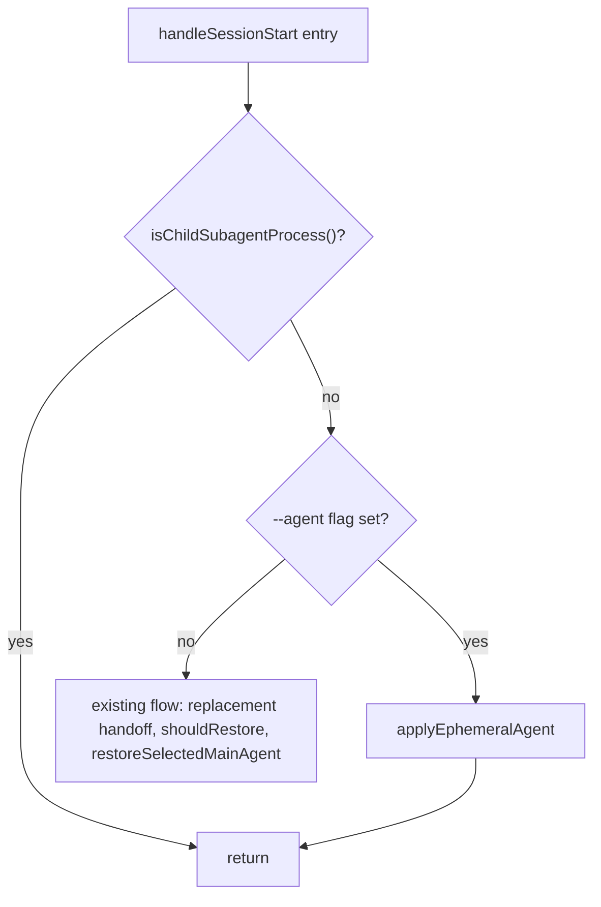
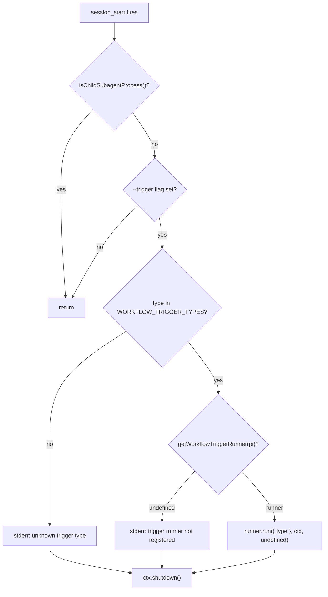

# Technical Solution: CLI Flags for Extension Control

## Problem Statement

- PRB-01: Extension functionality (agent selection, trigger invocation) cannot be controlled via CLI flags at pi startup. Only interactive slash commands and workflow stage triggers provide access.
- PRB-02: `reportIssue` in main-agent-selection returns early when `hasUI === false` (line 1157), producing no feedback in `-p` mode for invalid agent IDs.
- PRB-03: `WorkflowTriggerType` is a TypeScript union type with no runtime representation, making CLI-side validation of trigger type values impossible without a runtime constant.

## Proposed Solution

### Feature 1: `--agent <id>` — ephemeral agent selection

**File:** `pi-package/extensions/main-agent-selection/index.ts`

SOL-01: Register `--agent` string flag in `mainAgentSelection` factory function.

```typescript
pi.registerFlag("agent", {
  description: "Set main agent for this session (ephemeral, not persisted)",
  type: "string",
});
```

SOL-02: Modify `handleSessionStart` — insert flag check after `isChildSubagentProcess()` guard (line 375), before session replacement handoff (line 379). When flag is set, call `applyEphemeralAgent` and return without executing the existing restore flow.



SOL-03: New function `applyEphemeralAgent(pi, ctx, agentId)`:
- Load agents via `loadSelectableAgents(ctx.cwd)`.
- When `agentId.toLowerCase() === "none"`: call `getAgentRuntimeComposition(pi).clearMainAgentContribution()`, return.
- Find agent via `agentIdMatches(candidate.id, agentId)`.
- When found: call `applyAgentSelection(pi, ctx, agent)` without calling `writeSelectedAgentState`.
- When not found: call `reportAgentError` with a message naming the requested ID.

SOL-04: Error reporting for non-interactive mode — add `reportAgentError` wrapping existing `reportIssue` with stderr fallback:

```typescript
function reportAgentError(ctx: MainAgentContext, issue: string): void {
  if (ctx.hasUI === false) {
    process.stderr.write(`${ISSUE_PREFIX} ${issue}\n`);
    return;
  }
  reportIssue(ctx, issue);
}
```

### Feature 2: `--trigger <type>` — trigger invocation

**File:** `pi-package/shared/workflow-trigger-runtime.ts`

SOL-05: Add runtime constant mirroring `WorkflowTriggerType`:

```typescript
export const WORKFLOW_TRIGGER_TYPES = [
  "local_knowledge_accumulation",
  "global_knowledge_accumulation",
] as const satisfies readonly WorkflowTriggerType[];
```

When new trigger types are added to the union, this constant is updated in the same file. Consumers import the constant, not individual values.

**File:** `pi-package/extensions/workflow/index.ts`

SOL-06: Register `--trigger` string flag in `workflowExtension` factory function.

```typescript
pi.registerFlag("trigger", {
  description: "Run a workflow trigger at startup and exit",
  type: "string",
});
```

SOL-07: Add new `session_start` handler in `workflowExtension` factory, separate from `registerWorkflowLifecycle` handler. This handler runs after the existing lifecycle synchronization because it is registered later in the same factory.



SOL-08: The `signal` parameter passed to `runner.run()` is `undefined`. This is expected behavior during `session_start` events. LLM calls made by the trigger runner will not be cancellable via `AbortSignal` but will complete normally.

SOL-09: After trigger execution (success or failure), call `ctx.shutdown()`. In interactive mode, shutdown is deferred until the agent becomes idle — immediate at `session_start` because no prompts are queued. In `-p` mode, `ctx.shutdown()` is a no-op and the process exits after processing prompts.

## Overengineering and Overspecification Considerations

- No new modules or extensions created — changes are additions to existing files.
- `applyEphemeralAgent` reuses existing `applyAgentSelection` and `loadSelectableAgents` functions — no logic duplication.
- `WORKFLOW_TRIGGER_TYPES` is a single constant in the file that already defines `WorkflowTriggerType` — no new abstraction layer.
- Trigger invocation reuses existing `getWorkflowTriggerRunner` and `WorkflowTriggerRunner.run` — no new dispatch mechanism.
- Error reporting (`reportAgentError`) wraps existing `reportIssue` with a stderr fallback — minimal change.

## Open Questions

None. All design decisions resolved during Analysis and PRD stages.

## References

- REF-01: `pi-package/extensions/main-agent-selection/index.ts` — agent selection extension (handleSessionStart line 364, selectMainAgent line 650, applyAgentSelection line 775, reportIssue line 1156)
- REF-02: `pi-package/shared/workflow-trigger-runtime.ts` — trigger runner abstraction (WorkflowTriggerType, registerWorkflowTriggerRunner, getWorkflowTriggerRunner)
- REF-03: `pi-package/extensions/workflow/index.ts` — workflow extension (workflowExtension line 375, registerWorkflowLifecycle line 429, runEnteredStageTriggers line 286)
- REF-04: `pi-package/extensions/knowledge/index.ts` — knowledge extension trigger runner registration (createKnowledgeTriggerRunner line 200, runKnowledgeTrigger line 267)
- REF-05: `docs/specs/features/cli-flags/light-prd.md` — approved Light PRD with critical requirements
- REF-06: `docs/specs/features/cli-flags/problem-statement.md` — approved Problem Statement
