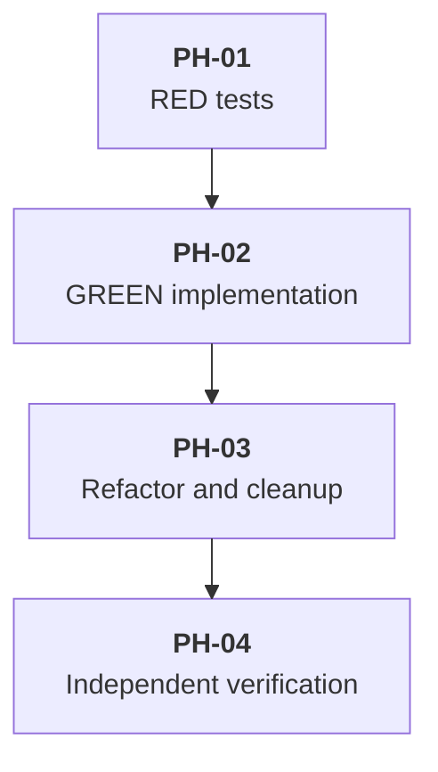

# Delivery Plan: Conditional Local Instructions for MCP Servers

Implement the approved `additionalInstructions` configuration field without changing MCP discovery, active-tool reconciliation, or the metadata cache schema.

## Key Definitions and Abbreviations

- DEF-01: **Local MCP instructions** are the nonblank `additionalInstructions` string from one parsed MCP server configuration.
- DEF-02: **Server-provided MCP instructions** are instructions returned by the MCP server during initialization.
- DEF-03: **Eligible server** is an MCP server with at least one accepted Pi tool in the runtime catalog.
- DEF-04: **Visible server** is an eligible server with at least one Pi tool in the current runtime's final `pi.getActiveTools()` result.

## Delivery Strategy

- STR-01: Ship the behavior as an additive configuration capability controlled by the presence of `mcpServers.<server>.additionalInstructions`; no feature flag or data migration is needed.
- STR-02: Keep local MCP instructions in parsed configuration state and out of discovered metadata and persisted metadata cache state.
- STR-03: Follow RED-GREEN-REFACTOR because the change affects configuration parsing and runtime system-prompt behavior.

## Approach Evaluation

### APP-01: Extend the Existing Instruction Record Builder — Selected

- APP-01-C: Complexity is low: update the strict parser, cache hash projection, instruction record builder, and one caller.
- APP-01-M: Maintainability is high because one record, one active-tool filter, and one renderer remain responsible for both instruction sources.
- APP-01-P: Runtime cost remains one startup-time grouping pass and one existing prompt-time active-tool scan; the design adds no I/O or event handler.
- APP-01-R: The main risks are source ordering, whitespace preservation, and accidental cache coupling; focused behavior tests cover each risk.

### APP-02: Add a Separate Local-Instruction Prompt Handler — Rejected

- APP-02-C: Complexity is higher because state clearing, server-to-tool mapping, active-tool filtering, escaping, and rendering are duplicated.
- APP-02-M: Maintainability is lower because two handlers can produce duplicate `<mcp_instructions>` or `<server>` blocks.
- APP-02-P: Every prompt start performs an additional scan and render path.
- APP-02-R: Handler ordering becomes a new behavior contract without solving a product requirement.

### APP-03: Inject Local Instructions into Discovery Metadata — Rejected

- APP-03-C: Complexity is higher because local-only servers still require reconstruction after discovery or cache loading.
- APP-03-M: Maintainability is lower because configuration-authored prompt text becomes coupled to MCP discovery and persisted metadata.
- APP-03-P: Runtime cost is similar to APP-01, but cache identity and refresh behavior become easier to regress.
- APP-03-R: The approach conflicts with the requirement that local instructions neither enter the metadata cache nor invalidate it.

## Main Changes

- CHG-01: Extend `McpServerConfig` and both transport parsers in [`config.ts`](../../../../pi-package/extensions/mcp-wrapper/config.ts) with strict `additionalInstructions` handling.
- CHG-02: Exclude `additionalInstructions` from `computeMcpServerConfigHash` in [`metadata-cache.ts`](../../../../pi-package/extensions/mcp-wrapper/metadata-cache.ts).
- CHG-03: Extend `buildActiveServerInstructions` and its session-start caller in [`index.ts`](../../../../pi-package/extensions/mcp-wrapper/index.ts) to assemble one combined record per eligible server.
- CHG-04: Preserve `registerMcpInstructionPromptHandler`, `renderMcpInstructions`, and final active-tool ownership in [`agent-runtime-composition.ts`](../../../../pi-package/shared/agent-runtime-composition.ts).
- CHG-05: Update behavior tests and [`docs/extensions/mcp-wrapper.md`](../../../extensions/mcp-wrapper.md).

## Entities and Invariants

- INV-01: A server contributes at most one `ServerInstructionRecord`.
- INV-02: Server-provided text precedes local text; two present sources are separated by exactly one blank line.
- INV-03: `trim()` determines only whether local text is blank. A nonblank value retains its original bytes for rendering.
- INV-04: A record exists only for an eligible server with at least one nonblank instruction source.
- INV-05: A record renders only for a visible server.
- INV-06: `CachedMcpServerMetadata` and the metadata cache version do not change.

## New Folders and Components

- NEW-01: No new production folder, component, event handler, cache field, or composition layer is introduced.

## Phased Plan

### Phase Tree

### Decomposition Justification

- DEC-01: PH-01 intentionally ends with assertion failures because a passing RED phase would not prove that the tests exercise missing behavior.
- DEC-02: Parser, cache identity, and record assembly enter GREEN together because they form one configuration-to-prompt path; splitting them would create nonfunctional intermediate production states.
- DEC-03: Refactoring, documentation, and cleanup follow GREEN so behavior-preserving changes run against passing tests.
- DEC-04: Independent verification remains separate from implementation to test package loading and real runtime prompt/tool state rather than only unit-test fakes.

## Overengineering and Overspecification Considerations

- OVR-01: The plan reuses the existing parser patterns, record type, prompt handler, renderer, and active-tool filter.
- OVR-02: The plan excludes arrays, file references, templates, per-agent overrides, new cache data, and new composition abstractions because the approved requirements do not need them.
- OVR-03: Tests target public configuration and prompt behavior rather than helper implementation details or arbitrary prompt wording.

### Phase PH-01 — RED Behavior Tests

#### Goal

- PH-01-G: Establish failing behavior contracts before production implementation.

#### Work

- PH-01-W1: Extend [`config.test.ts`](../../../../pi-package/extensions/mcp-wrapper/config.test.ts) for both transports: preserve nonblank multiline text, omit empty and whitespace-only text, and reject defined non-string values.
- PH-01-W2: Extend [`metadata-cache.test.ts`](../../../../pi-package/extensions/mcp-wrapper/metadata-cache.test.ts) to prove that changing only `additionalInstructions` preserves the configuration hash while changing a connection field changes it.
- PH-01-W3: Extend [`index.test.ts`](../../../../pi-package/extensions/mcp-wrapper/index.test.ts) for local-only instructions, server-provided-then-local ordering, no accepted tool, no active matching tool, deferred activation, and later startup state clearing.
- PH-01-W4: Extend [`mcp-wrapper-system-prompt.test.ts`](../../../../test/integration/mcp-wrapper-system-prompt.test.ts) to prove final-active filtering after system-prompt replacement and for a restrictive child-agent tool policy.
- PH-01-W5: Run the changed test files and record assertion failures caused by missing `additionalInstructions` behavior; compilation, fixture, timeout, or dependency failures do not satisfy RED.

#### Deliverables

- PH-01-D: Compiling behavior tests that fail only at the new expected outcomes.

#### Exit Criteria

- PH-01-E1: Every added test reaches its designated assertion and fails because production behavior is absent.
- PH-01-E2: Tests use existing fakes, isolated fixtures, and explicit configured instruction text.

#### Risks

- PH-01-R: Over-testing internal helpers would make refactoring costly; tests assert parsed output, hash identity, final prompt content, source order, and visibility only.

### Phase PH-02 — GREEN Minimum Implementation

#### Goal

- PH-02-G: Make the PH-01 behavior tests pass with the smallest coherent production change.

#### Work

- PH-02-W1: Add the optional field, allowed keys, type validation, blank detection, and original-text preservation in [`config.ts`](../../../../pi-package/extensions/mcp-wrapper/config.ts).
- PH-02-W2: Remove `additionalInstructions` from the connection identity projection in `computeMcpServerConfigHash` without changing cache parsing, serialization, or version.
- PH-02-W3: Assemble combined instruction records from parsed server configurations, server-provided instructions, and accepted catalog tools in `buildActiveServerInstructions`.
- PH-02-W4: Pass parsed MCP server configurations from `handleSessionStart` to the record builder; leave the prompt handler, renderer, and `AgentRuntimeComposition` unchanged.
- PH-02-W5: Run focused tests after each cohesive change, then all `mcp-wrapper` tests.

#### Deliverables

- PH-02-D: Working configuration-to-prompt behavior with no new runtime or persistence subsystem.

#### Exit Criteria

- PH-02-E1: All PH-01 tests and existing `mcp-wrapper` tests pass.
- PH-02-E2: A combined server renders one block, and a server without an accepted tool renders no local instructions.

#### Risks

- PH-02-R1: Adding the field to the config hash would cause unnecessary discovery; the hash test prevents this regression.
- PH-02-R2: Iterating only server-provided records would omit local-only servers; the local-only prompt test prevents this regression.

### Phase PH-03 — REFACTOR, Documentation, and Cleanup

#### Goal

- PH-03-G: Simplify the passing implementation and remove implementation residue without changing behavior.

#### Work

- PH-03-W1: Extract one small parser helper only when it removes duplicated transport validation while keeping the configuration contract explicit.
- PH-03-W2: Remove temporary scaffolding, debug output, test-only production branches, duplicate record paths, dead helpers, stale comments, workarounds, linter suppressions, and code slop introduced during implementation.
- PH-03-W3: Update [`docs/extensions/mcp-wrapper.md`](../../../extensions/mcp-wrapper.md) with the field, JSON `\n` notation, blank-value behavior, source order, final-active condition, and cache-hash behavior.
- PH-03-W4: Run focused tests, `bun run typecheck`, and `bun run check` after refactoring and documentation changes.

#### Deliverables

- PH-03-D1: Readable production code with one instruction assembly path.
- PH-03-D2: Updated extension documentation matching the tested contract.

#### Exit Criteria

- PH-03-E1: Focused tests, typecheck, and check pass.
- PH-03-E2: No temporary implementation or debugging artifacts remain.

#### Risks

- PH-03-R: Premature helper extraction can obscure the two transport parsers; retain inline code when a helper does not materially reduce duplication.

### Phase PH-04 — Independent Verification

#### Goal

- PH-04-G: Verify the completed change through repository-wide checks and real Pi runtime data.

#### Work

- PH-04-W1: Run `bun run test`, `bun run typecheck`, `bun run check`, and `bun run verify`. Do not invent build or coverage commands because the repository declares neither script.
- PH-04-W2: From `pi-package`, validate single-extension and whole-package loading with the project-prescribed `pi --no-session -p -e` commands and extension isolation flags.
- PH-04-W3: Use temporary configuration, state, and a temporary debug extension to capture `before_agent_start.systemPrompt` and `pi.getActiveTools()` for main-agent and child-agent paths.
- PH-04-W4: Inspect runtime captures for local-only visibility with a matching final-active tool, combined source order, omission under a restrictive child policy, and one server block.
- PH-04-W5: Remove all temporary verification files and state.

#### Deliverables

- PH-04-D: Command results and inspected runtime evidence for the final behavior.

#### Exit Criteria

- PH-04-E1: Repository-wide scripts and both Pi loading checks exit successfully.
- PH-04-E2: Main-agent and child-agent runtime captures satisfy PH-04-W4.
- PH-04-E3: Temporary verification artifacts are removed.

#### Risks

- PH-04-R: Global extensions or persistent state can contaminate runtime evidence; isolate extensions and use temporary working and state directories.

## Test Strategy

- TST-01: Parser unit tests own field type, blank detection, and original-text preservation.
- TST-02: Metadata-cache unit tests own cache identity exclusion.
- TST-03: Extension behavior tests own record assembly, lifecycle clearing, deferred activation, and prompt rendering.
- TST-04: Integration tests own final active-tool filtering after all prompt and child-agent composition layers.
- TST-05: Real Pi checks own package loading and actual prompt/tool availability; they do not replace isolated automated tests.

## Dependencies and Resourcing

- DEP-01: No new package, service, network dependency, migration, or persistent schema is required.
- DEP-02: Implementation uses Bun scripts and the installed Pi CLI defined by repository guidance.

## Project Definition of Done

- DOD-01: Approved configuration, merge, visibility, whitespace, and cache behavior is implemented and documented.
- DOD-02: Focused, repository-wide, loading, and real runtime checks pass.
- DOD-03: No workaround, fallback, temporary branch, debug artifact, linter suppression, or unrelated refactor remains.

## Assumptions

- ASM-01: The repository's existing child-agent runtime path can produce the restrictive-tool runtime required by PH-04-W3. Verification occurs while constructing the temporary runtime check before accepting PH-04.

## Open Questions

- OQ-01: None.

## Standards Deviations

- DEV-01: None.

## References

- REF-01: [`mcp_wrapper_additional_instructions_problem.md`](mcp_wrapper_additional_instructions_problem.md) - approved problem and glossary.
- REF-02: [`mcp_wrapper_additional_instructions_prd.md`](mcp_wrapper_additional_instructions_prd.md) - approved behavior requirements.
- REF-03: [`mcp_wrapper_additional_instructions_solution.md`](mcp_wrapper_additional_instructions_solution.md) - approved technical solution.
- REF-04: [`AGENTS.md`](../../../../AGENTS.md) - repository development, testing, and validation rules.
