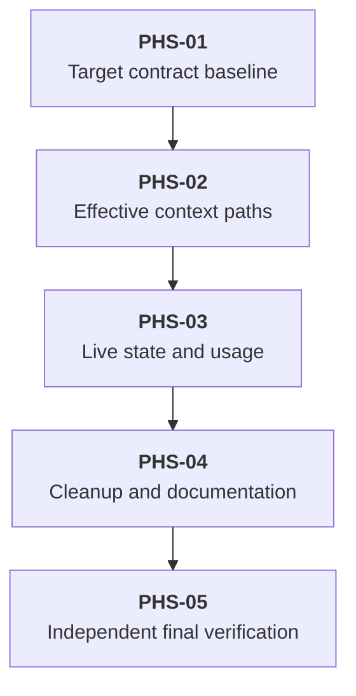

# Delivery Plan: Pi 0.87.0 Migration

Implement the approved component-purpose requirements in [prd.md](docs/specs/issues/pi-0.87.0-migration/prd.md) through D4-D11 and D7.1 in [solution.md](docs/specs/issues/pi-0.87.0-migration/solution.md). The requirements and solution are ready for implementation. This plan contains future work; no implementation or runtime validation occurred during the re-review.

## Key definitions and abbreviations

- Effective context: Pi's compaction-aware, context-edited messages.
- Canonical mapping: effective messages paired with their raw source entries through Pi `buildSessionProjection()`.
- Effective replacements: repository projection replacements that remain valid after active-branch context edits.
- Usable response: a canonically visible assistant response with non-error, non-aborted, positive usage. Reuse [hasValidAssistantContextUsage](pi-package/shared/context-projection.ts) for the usage predicate.
- Pending savings: effective projection savings not already reflected in the native Pi usage estimate.
- RED-GREEN-REFACTOR: execute a failing behavior assertion, implement the smallest passing change, then simplify without changing behavior. An import or compiler error is not RED.

## Delivery Strategy

Use one target-version migration with sequential internal verification gates. No feature flag, dual-version path, or session-file rewrite is needed. Preserve the append-only projection-state format. Do not use the isolated prototype as a patch source.

The [recorded experiment](docs/specs/issues/pi-0.87.0-migration/solution.md) establishes the baseline failures and target-version loading evidence. Do not repeat that experiment. Implementation verification must exercise the changed repository with temporary state and deterministic providers.

## Main Changes

### Requirement traceability

| Requirement | Solution owner | Slice and verification |
|---|---|---|
| FRQ-01: Pi 0.87.0 | D4 | PHS-01 updates both manifests and three locks. PHS-05 checks actual resolution at both package roots. |
| FRQ-02: no Pi 0.86.1 support | D4; REFACTOR | PHS-01 uses target contracts. PHS-04 removes obsolete imports and checks for compatibility residue. |
| FRQ-03: shorten eligible results without restoring edited content | D5, D6, D7 | PHS-02 checks canonical mapping. PHS-03 checks live projection and invalidated runtime state. |
| FRQ-04: effective, isolated auxiliary context | D5, D7, D8 | PHS-02 checks persisted and runtime replay through the D8 consumers. PHS-03 checks runtime precedence. |
| FRQ-05: effective custom-compaction input | D5, D7, D9 | PHS-02 checks canonical replay and source candidates. PHS-03 rejects stale stored summaries. The named repeated-compaction defect remains excluded. |
| FRQ-06: raw council evidence | D10 | PHS-01 checks raw target output and no separate edit block. |
| FRQ-07: useful usage and no projection-caused premature trigger | D7, D7.1 | PHS-03 checks both accounting modes through shared usage and trigger decisions. PHS-05 verifies the real Pi recovery boundary. |
| FRQ-08: checks and loading | D4, D11; Final verification | PHS-01 adapts the lifecycle assertion. PHS-05 runs the aggregate checks, resolution, loading, and changed-runtime checks. |
| NRQ-01: evidence before adopting preliminary claims | Core approach; recorded experiment | Use the supplied evidence and the repository map below. Do not add a change based only on an unverified preliminary claim. |
| NRQ-02: release, public-contract, implementation, and failure coverage | D4-D11; exclusions | The map below identifies the source boundaries. PHS-05 verifies the combined artifact, including untouched consumers. |
| NRQ-02.1: isolated target-version checks | Recorded experiment; Final verification | All implementation fixtures and runtime checks use temporary state, fake providers, and no real user data. |
| NRQ-03: stop for a product-purpose decision | PRD blocker rule | No such decision is open. A failing purpose scenario during implementation stops its affected slice and returns to design. |
| NRQ-04: canonical public APIs and no legacy algorithm copy | D5, D7.1; REFACTOR | PHS-02 uses the public projection. PHS-03 derives accounting mode from public projection and branch order. PHS-04 rejects private imports and duplicate context algorithms. |

### Exact source and caller map

| Boundary | Paths and symbols | Implementation responsibility |
|---|---|---|
| Dependency contract | [package.json](package.json), [pi-package/package.json](pi-package/package.json), [bun.lock](bun.lock), [pi-package/bun.lock](pi-package/bun.lock), [pi-package/package-lock.json](pi-package/package-lock.json) | Four exact Pi 0.87.0 packages at root and package resolution boundaries. Preserve direct `typebox` unless a separate target incompatibility is established. |
| Canonical mapping | [shared/context-projection.ts](pi-package/shared/context-projection.ts): `buildContextEntryMapping`, `mapEventMessagesToBranchEntries`, `isMatchingContextMessage`, `isPersistedProviderError` | Flatten projected messages with `sourceEntry`. Remove system messages only for event matching. Preserve custom-message timestamp tolerance and provider-error handling. |
| State replay | [shared/context-projection.ts](pi-package/shared/context-projection.ts): `collectProjectedReplacementsFromEntries`, `collectProjectedReplacements`, `mergeProjectedReplacements`, `publishRuntimeProjectedReplacements`, `replayPersistedContextProjection`, `replayContextProjection`, `replayRetainedContextProjection` | One append-order rule for branch state and runtime reconciliation. Persisted replay must not acquire live-cache state. |
| Live state | [context-projection/index.ts](pi-package/extensions/context-projection/index.ts): `contextProjection`, `handleContextProjection`, `createContextEventProjectionDecision`, `createProjectionDecision`, `recordProjectionTransition`, `recordProjectionState` | Reconcile replacements before replay, discovery, summary candidate selection, and savings. Lifecycle restoration alone cannot see every intervening edit. Keep projection-level progression separate from replacement validity. |
| Usage owner | [shared/context-projection.ts](pi-package/shared/context-projection.ts): `hasValidAssistantContextUsage`, `collectPendingProjectedReplacements`, `estimatePendingProjectionSavings`, `estimateProjectedSavedTokens`, `setPendingProjectionSavings`, `addPendingProjectionSavings`, `getProjectionAwareContextUsage` | Implement D7.1's two modes. Reconcile branch-backed and live savings without double counting. Do not use a failed or zero-usage response as a usage checkpoint. |
| Usage synchronization and consumers | [context-projection/index.ts](pi-package/extensions/context-projection/index.ts): `syncPendingProjectionSavings`, `estimateCurrentProjectedSavedTokens`, `resolveActiveProjectionLevel`; [compaction-trigger/index.ts](pi-package/extensions/compaction-trigger/index.ts): `handleContext`; [footer/index.ts](pi-package/extensions/footer/index.ts): `readFooterRenderState` | Make all three consumers use the corrected shared estimate. Signature or synchronization changes may update callers, but threshold policy and footer rendering remain intact. |
| Saved query | [run-subagent/index.ts](pi-package/extensions/run-subagent/index.ts): `executeQueryTool`; [session-snapshot-loader.ts](pi-package/extensions/run-subagent/session-snapshot-loader.ts): `SessionSnapshotLoader.loadOnce`; [subagent-query.ts](pi-package/extensions/run-subagent/subagent-query.ts): `executeSubagentQuery`, `buildQueryContext` | Raw branch → persisted canonical replay → remove system messages → convert conversation → append one question. Keep caller-local model selection and empty tools. |
| Other auxiliary replay | [ask-llm/index.ts](pi-package/extensions/ask-llm/index.ts): `buildContext`; [consult-advisor/index.ts](pi-package/extensions/consult-advisor/index.ts): `buildAdvisorContext`; [knowledge/algorithms.ts](pi-package/extensions/knowledge/algorithms.ts): `runLocalKnowledgeAccumulation` | All use shared runtime replay. Keep system filtering at request boundaries. Keep advisor pending-call removal, knowledge formatting, dedicated prompts, and empty tools. No separate edit logic belongs here. |
| Custom compaction | [custom-compaction/index.ts](pi-package/extensions/custom-compaction/index.ts): `resolveProjectedContexts`; [compaction-source-projection.ts](pi-package/extensions/custom-compaction/compaction-source-projection.ts): `projectCompactionSource`, `collectMissingProjectionCandidates`, `collectCompactionToolCallIds`; [adaptive-compaction.ts](pi-package/extensions/custom-compaction/adaptive-compaction.ts): `adaptiveCompactHistory` | Canonical main and retained replay → auxiliary filtering → candidates from Pi's prepared discarded range → summary generation. The candidate selector already calls the shared mapper. Avoid a duplicate production fix. |
| Council | [convene-council/context.ts](pi-package/extensions/convene-council/context.ts): `buildExternalCouncilContextPackage`, `renderExternalContextPackage`, `renderContextEntry` | Keep the raw branch path. Ignore edit records through an explicit switch case. |
| Lifecycle integration | [compaction-overflow-retry.test.ts](test/integration/compaction-overflow-retry.test.ts): `threshold interruption compacts and resumes through real AgentSession boundaries`; [child-rpc-completion.ts](pi-package/shared/child-rpc-completion.ts): `ChildRpcPromptCompletionState.handleSessionEvent` | Use system-free event assertions while retaining interruption, compaction, continuation, provider-request, and settlement checks. |

## Entities and Invariants

- Each effective message retains source-entry ownership. One compaction entry can own both a system checkpoint and a summary.
- Omission produces no effective target message. Replacement content comes from Pi normalization. Raw history is not rewritten.
- A later context edit invalidates an older repository replacement for its target. A later projection record can replace the edited content again.
- Branch state defeats stale runtime state. Live savings cannot survive an invalidated replacement merely because the old scalar batch remains in memory.
- D7.1 uses append order, not wall-clock timestamps. A usable response after the latest edit or compaction selects response-based accounting. No usable response after that boundary selects canonical-estimate accounting.
- Response-based accounting subtracts only effective savings recorded after the response. Canonical-estimate accounting subtracts all effective active savings. Native `tokens: null` remains null, and adjusted tokens cannot be negative.
- An error, aborted response, zero-usage response, or omitted assistant does not establish a usage checkpoint. This uses the repository's usage predicate and Pi's canonical visibility, not a new product policy.
- Auxiliary replay consumers use their dedicated system prompt and no main-agent tools. Council follows the explicit raw-evidence requirement instead.
- Failed persistence publishes neither new replacements nor new savings. Existing ignored-tool, recent-turn, skill-read, cancellation, and summary retry rules remain regression guards.

## New Folders and Components

No new production component or storage format is required. A focused [compaction-source-projection.test.ts](pi-package/extensions/custom-compaction/compaction-source-projection.test.ts) can hold module-level candidate tests without importing another extension entry point. Reuse [test/support/temp-dir.ts](test/support/temp-dir.ts) and the existing deterministic integration patterns.

## Backward Compatibility

No backward compatibility with Pi 0.86.1. Keep the session and projection-state persistence formats. Do not add version branches, adapters, fallback types, or a session migration.

## Phased Plan

### Phase Tree

### Decomposition Justification

PHS-01 combines target setup with the exhaustive switch and lifecycle assertion needed for a usable target baseline. PHS-02 delivers canonical data through its consumers rather than changing a helper without boundary coverage. PHS-03 follows state through persistence, runtime replay, usage, and trigger decisions. Those phases share the mapping module and must run in sequence. PHS-04 removes residue before PHS-05 verifies the final artifact.

The intermediate slices are not separate releases. Canonical replay is testable before live-state reconciliation is complete, but the migration is complete only after both. No temporary compatibility code is needed to conceal that dependency. Every exit checks a required behavior or target contract; none requires tests of constants, deleted features, or documentation wording.

## Overengineering and Overspecification Considerations

Use Pi to construct context. Implement only repository-owned replacement precedence and the D7.1 mode selection. Keep the existing savings estimator rather than copying Pi's private token estimator. Do not add a new ledger, generalized event framework, cache-generation system, or per-consumer edit engine. The repeated-compaction retained-context defect has its own [problem statement](docs/specs/issues/repeated-compaction-retained-context/problem.md) and is excluded from this plan.

### Phase PHS-01 - Establish the target contract baseline

#### Goal

Make the package compile and exercise its raw council and compaction lifecycle contracts on Pi 0.87.0.

#### Work

1. With implementation and dependency-change authorization, apply D4 to both manifests and all three lock files. Check all four resolved versions from both roots. Do not upgrade unrelated direct dependencies.
2. RED: extend [convene-council/context.test.ts](pi-package/extensions/convene-council/context.test.ts). Use a raw target followed by omission and replacement edits. Assert a successful render with the raw evidence and no extra edit block. Run the behavior assertion before changing the renderer.
3. GREEN: add an explicit `context_edit` case to [renderContextEntry](pi-package/extensions/convene-council/context.ts). Keep the exhaustive switch without a default. Dependency setup and the exhaustive-switch repair are one compilation gate; a compiler error is not the behavior RED.
4. Update [compaction-overflow-retry.test.ts](test/integration/compaction-overflow-retry.test.ts) for D11. Assert relative event-message growth before compaction and reduction afterward. Assert system-free roles. Keep one interruption, one compaction, exactly one hidden continuation, two provider requests, and one successful settlement. Replace the continuation `find`-only check with a count plus hidden-display check.
5. REFACTOR: remove obsolete version-specific comments from touched tests. Do not alter trigger production thresholds or settled-run policy.

Dependency configuration and correction of an obsolete test expectation do not need artificial RED tests. The council behavior does.

#### Deliverables

Target manifests and locks, explicit raw edit handling, and the target-correct lifecycle integration assertion.

#### Exit criteria

Both roots resolve the four Pi packages to 0.87.0. Typecheck passes. The council behavior and active lifecycle integration pass. The recorded existing skipped integration test remains disclosed, not counted as executed coverage.

#### Risks

A stale standalone lock can preserve Pi 0.86.1 despite updated manifest text. Verify resolution rather than text alone. Do not treat dependency/import failures as valid RED.

### Phase PHS-02 - Deliver effective context to projection and auxiliary consumers

#### Goal

Use Pi-edited messages with correct source ownership throughout canonical replay and event mapping.

#### Work

1. RED: extend `context entry mapping` and `context projection replay` in [shared/context-projection.test.ts](pi-package/shared/context-projection.test.ts). Assert omission, replacement normalization, source IDs, raw-target immutability, and a compaction entry with multiple messages. Keep the tests for provider errors and custom timestamp tolerance.
2. RED: provide a branch containing system entries and an independently constructed system-free event. Assert successful mapping and actual live projection in [context-projection/index.test.ts](pi-package/extensions/context-projection/index.test.ts). Do not build expected event contents by calling the production mapper under test.
3. RED: extend [subagent-query.test.ts](pi-package/extensions/run-subagent/subagent-query.test.ts), especially `answers from isolated persisted branch context with caller-local defaults`. Assert edited historical structures, one appended question by role/count, and empty tools. A live runtime replacement must not enter persisted-only replay.
4. RED: extend [custom-compaction/index.test.ts](pi-package/extensions/custom-compaction/index.test.ts) for omitted and replaced results in main and retained replay. Use coherent Pi preparation data. Add focused source-candidate coverage at [compaction-source-projection.test.ts](pi-package/extensions/custom-compaction/compaction-source-projection.test.ts): omitted target produces no candidate; replacement supplies edited content with the original source ID and tool-call ID; candidate size and discarded-range rules still apply.
5. GREEN: change [buildContextEntryMapping](pi-package/shared/context-projection.ts) to flatten public Pi projection entries. Change event mapping to compare only non-system messages. Keep canonical replay system state until the auxiliary boundary removes it.
6. GREEN: let the shared change serve query, ask-llm, advisor, knowledge, and compaction. Keep the consumer boundaries in the repository map. The source-candidate selector already uses the shared mapper; add no duplicate edit algorithm.
7. REFACTOR: remove unused legacy context-builder imports. Update touched mapping tests that previously derived expected events from legacy helpers. Test transformed structures, not prompt text.

#### Deliverables

Canonical mapping, system-free matching, and effective-context coverage through live projection, saved query, and compaction.

#### Exit criteria

Targeted behavior checks pass. Pi edits apply with repository projection enabled, disabled, and missing. Auxiliary requests remain tool-less with dedicated system state. Source candidates use edited data and keep the configured size/range constraints. The excluded repeated-compaction algorithm remains unchanged.

#### Risks

Whole-branch canonical replay contains system messages; filtering them globally would violate the separation between mapping and request boundaries. Synthetic compaction preparation that still contains a Pi-omitted target would test an impossible target-version contract.

### Phase PHS-03 - Reconcile live state and projection-aware usage

#### Goal

Make replay, displayed usage, and trigger decisions agree with effective projection after edits and model responses.

#### Work

1. RED: cover projection state → context edit → later projection state for one target, plus an unrelated target. Assert canonical edited content after invalidation and the later recorded replacement afterward. Test omitted targets, branch selection, stale runtime maps, and empty state batches in [shared/context-projection.test.ts](pi-package/shared/context-projection.test.ts).
2. RED: drive the live handler through projection, a branch-visible edit, and a new context event without an intervening session lifecycle event. Assert edited output, effective savings, and threshold-driven discovery. Reuse the branch-restoration, persistence-failure, and pending-savings tests in [context-projection/index.test.ts](pi-package/extensions/context-projection/index.test.ts).
3. RED: cover both D7.1 modes. In response-based mode, a later usable response clears earlier savings while later projection records remain pending. In canonical-estimate mode, an unrelated recovery edit restores all effective savings to the correction. An edit that invalidates the projected target removes its old savings instead. Cover no usable response, error/aborted/zero usage, omitted usage-bearing assistant, compaction with null usage, clamping, and the next successful response.
4. RED: cover live-batch reconciliation. A branch-visible replacement must not remain counted in both branch and live state. A context edit must not leave an invalidated scalar batch active. Include a batch with one invalidated target and one still-effective target. The existing append-call recorder does not mutate its branch; use a branch-visible append fake for ordering cases and retain the delayed-visibility cases separately.
5. RED: test the public effect through [compaction-trigger/index.test.ts](pi-package/extensions/compaction-trigger/index.test.ts) and the usage consumed by [footer/index.test.ts](pi-package/extensions/footer/index.test.ts). Choose a fixture whose raw native estimate is above threshold but whose projection-aware estimate is below. Expected result: no interruption caused solely by ignored projection, and matching corrected usage for the footer. Do not assert rendered decoration or prompt text.
6. GREEN: centralize append-order replacement reconciliation in [shared/context-projection.ts](pi-package/shared/context-projection.ts). Apply it to persisted replay, runtime merge, retained replay, live replacement refresh, and savings. Refresh live state before it can restore stale content or feed a usage decision.
7. GREEN: derive the D7.1 mode from canonically visible usable responses and raw active-branch append order. Use the existing usage predicate. Select only post-response effective savings in response-based mode and all effective savings in canonical-estimate mode. Preserve native null usage. Do not import Pi's private estimator or copy context construction.
8. GREEN: reconcile pending live batches with branch-backed state. Make [getProjectionAwareContextUsage](pi-package/shared/context-projection.ts), the projection extension's synchronization, and its footer/trigger callers agree when usage is read. Update shared-call signatures or synchronization only as needed; do not change thresholds or rendering policy.
9. REFACTOR: keep one state fold and one accounting-mode owner. Remove duplicate cache-priority logic. Retain the projection-state format and failed-append cleanup.

#### Deliverables

Ordered replacement state, two-mode accounting, reconciled live savings, and public usage/trigger coverage.

#### Exit criteria

A runtime cache cannot override a later branch edit. New recorded projection can shorten edited content. Native canonical re-estimation still accounts for active repository projection. A later usable response ends the old correction. Invalidated replacements and already persisted batches are not counted. Footer and trigger receive the same shared correction. The complete behavior suite passes.

#### Risks

Updating only persisted collection leaves the live closure or runtime merge stale. Updating only replacement validity leaves pending scalar batches stale. Selecting the last raw assistant rather than a visible usable response chooses the wrong accounting mode. These paths form one vertical slice because a partial change can produce plausible but incorrect usage.

### Phase PHS-04 - Clean up and document the delivered contracts

#### Goal

Leave a small target-only implementation and accurate extension documentation.

#### Work

Remove unused imports, temporary debugging extensions, temporary fixtures, and implementation workarounds. Check touched code for private Pi imports, compatibility branches, duplicate edit logic, and linter suppressions. Do not fix unrelated code.

Update only affected statements in [context-projection.md](docs/extensions/context-projection.md), [custom-compaction.md](docs/extensions/custom-compaction.md), and [convene-council.md](docs/extensions/convene-council.md). Describe effective versus raw context, projection-state ordering, and two-mode usage. Keep the repeated-compaction issue outside this migration.

RED-GREEN-REFACTOR is not needed for documentation or unused-import removal. Rerun affected behavior checks after code cleanup. Do not add tests for absent imports or document text.

#### Deliverables

Clean target-only source and the three focused documentation updates.

#### Exit criteria

The diff maps to approved decisions and requirements. It contains no new storage format, no Pi 0.86.1 support, no separate retained-suffix fix, and no temporary runtime files. Cleanup has not changed the passing behavior results.

#### Risks

Broad formatting or documentation rewrites can expand the migration. Use targeted changes and preserve unrelated content.

### Phase PHS-05 - Independently verify the final implementation

#### Goal

Establish implementation readiness from the final changed repository rather than the recorded prototype.

#### Work

1. Perform a fresh source pass against the requirement and caller maps. Review the complete final diff, not only the last cleanup changes.
2. Run `bun run verify`. This invokes the project's behavior tests, strict typecheck, and check script. Use the individual scripts to isolate failures; do not repeat passing commands merely to inflate the record.
3. Check the actual four-package resolution from both root and package directories. Check consistency of all three lock files. Preserve unrelated dependency policy.
4. Reuse [runtime-package-loading.test.ts](test/integration/runtime-package-loading.test.ts) for temporary cwd/state and deterministic providers. Check context-projection, custom-compaction, run-subagent, ask-llm, consult-advisor, knowledge, and convene-council individually, then the whole package. Include footer and compaction-trigger in combined behavioral coverage. Isolate global extensions with `--no-extensions`.
5. Use prompt-free offline mode only for loading checks. Real request checks require a fake provider, not `--offline` with a prompt. Do not use real auth, models, network calls, user files, or sessions.
6. Verify the implementation's runtime omission and replacement behavior, system-free context events, the real compaction lifecycle, and projection → successful response → recovery edit → trigger decision. Use the real in-memory Pi session boundary for native usage invalidation that unit fakes cannot prove.
7. For active-tool or prompt-ownership availability checks, use a temporary debug extension that captures `before_agent_start.systemPrompt` and `pi.getActiveTools()`. Inspect runtime structure and ownership. Do not add prompt-content assertions.
8. Remove temporary runtime state and debugging extensions. Record commands, outcomes, and skipped coverage against the implementation revision.

RED-GREEN-REFACTOR is not applicable to verification-only work. A behavior failure returns to its owning slice with an executable RED test before correction.

#### Deliverables

Final behavior, typecheck, check, version-resolution, package-loading, and focused runtime evidence.

#### Exit criteria

All executed gates pass. The existing skipped integration case is disclosed. Every approved requirement has final evidence. No unresolved failure of a component's primary scenario remains.

#### Risks

Fake-only coverage cannot establish Pi's native event or usage boundary. Offline loading cannot establish request behavior. Global extensions can contaminate loading checks. Use the specified isolated boundaries rather than creating another broad experiment harness.

## Test Strategy

| Behavior and purpose | Inputs → expected outputs | Edge cases | Dependencies and location |
|---|---|---|---|
| Mapping | Branch plus edits → normalized effective messages and source IDs | Omission, string replacement, raw immutability, compaction multi-message ownership | Public Pi builder; [shared mapping tests](pi-package/shared/context-projection.test.ts) |
| Event mapping | Branch with system entries plus system-free event → successful mapping and projection | Provider errors, custom timestamp-only mismatch, rejection of other mismatches | [shared tests](pi-package/shared/context-projection.test.ts), [live tests](pi-package/extensions/context-projection/index.test.ts) |
| Persisted/runtime replay | Ordered projection and edit records → effective replacement only | Later reprojection, other target, disabled config, runtime cache isolation | Shared replay plus [subagent-query tests](pi-package/extensions/run-subagent/subagent-query.test.ts) |
| Auxiliary isolation | Edited history → conversation plus one auxiliary input and empty tools | Advisor pending-call removal and knowledge source conversion | [ask-llm tests](pi-package/extensions/ask-llm/index.test.ts), [advisor tests](pi-package/extensions/consult-advisor/index.test.ts), [knowledge tests](pi-package/extensions/knowledge/algorithms.test.ts) |
| Compaction | Effective branch and prepared range → edited main/retained streams and eligible source candidates | Size threshold, tool-call ID, omitted target, stale replacement, cancellation | [extension tests](pi-package/extensions/custom-compaction/index.test.ts), new source module test |
| Council | Raw target plus edit records → raw evidence with no extra edit block | Omission and replacement | [context tests](pi-package/extensions/convene-council/context.test.ts) |
| Usage and trigger | Usable response or later edit boundary → D7.1 correction and threshold decision | No usable response, invalidation, partial batches, null, zero clamp, later success | Shared/live tests; [trigger tests](pi-package/extensions/compaction-trigger/index.test.ts); [footer tests](pi-package/extensions/footer/index.test.ts) |
| Lifecycle and native contract | Fake provider with real Pi session → expected interruption/compaction/continuation/settlement and recovery usage | System-free events and native checkpoint invalidation | [compaction integration](test/integration/compaction-overflow-retry.test.ts), package-loading patterns |

For source selection, record transformed messages or candidate objects before prompt construction. Stub the summary-generation boundary rather than asserting substrings inside a generated request. Reuse the existing injection and fake patterns. Tests must not import another extension entry point. New temporary fixtures use the shared helper.

No load test or stability program is needed: this migration adds neither a capacity requirement nor a background worker. Existing suites remain regression coverage for untouched model selection, retry handling, and rendering.

## Dependencies and Resourcing

- Target dependencies must resolve before target-only symbols and fixtures can compile.
- Dependency changes need implementation authorization. This review authorizes no package installation or repository change.
- PHS-02 and PHS-03 share source and stateful tests; execute them sequentially.
- No schedule, staffing, or new service assumption is required.

## Project Definition of Done

All thirteen approved requirements have implementation evidence. The package resolves Pi 0.87.0 at both roots and passes project scripts and isolated loading. Effective context reaches main projection and the D8 replay consumers. Council retains raw evidence. Active projection affects usage and trigger decisions in both D7.1 modes. The three extension documents match the delivered behavior. No unrelated defect, compatibility layer, private API dependency, or debug artifact enters the diff.

## Assumptions

- The current approved problem, terms, PRD, and solution define scope. The separate retained-context problem is explicitly excluded.
- The recorded experiment is accepted evidence. Its prototype results do not replace validation of the final implementation.
- The existing positive-usage predicate defines a usable response for D7.1. Canonical visibility and append order supply the additional selection conditions. Unit cases and the focused real-session check verify this integration during implementation.

## Open Questions

None blocks implementation. A discovered need to change component purpose returns to the user under NRQ-03. The excluded retained-context defect does not reopen migration scope.

## Standards Deviations

No software check was executed during this re-review, as requested. All RED, GREEN, typecheck, lint, loading, and runtime steps are future implementation gates. The simple Mermaid dependency graph is supplied as text; its rendered layout was not checked because no local renderer was available and installation was prohibited.

## References

- [Problem](docs/specs/issues/pi-0.87.0-migration/problem.md), [terms](docs/specs/issues/pi-0.87.0-migration/terms.md), [PRD](docs/specs/issues/pi-0.87.0-migration/prd.md), and [solution](docs/specs/issues/pi-0.87.0-migration/solution.md): approved baseline.
- [Separate retained-context issue](docs/specs/issues/repeated-compaction-retained-context/problem.md): excluded scope.
- [Pi 0.87.0 release notes](https://pi.dev/news/releases/0.87.0): target contracts.
- Target package `@earendil-works/pi-coding-agent@0.87.0`: public projection declarations and `dist/core/session-manager.js`; `dist/core/extensions/runner.js` for system-free events; `dist/core/agent-session.js` and `dist/core/compaction/compaction.js` for native usage and recovery behavior. These were read as evidence, not imported as private implementation dependencies.
