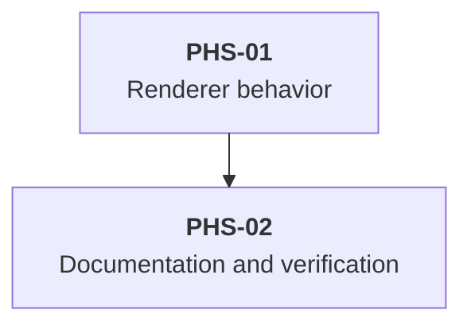

# Delivery Plan: Streaming Preview for `workflow_create`

This plan implements the approved streaming YAML preview in the workflow renderer, behavior tests, and extension documentation.

## Key definitions and abbreviations

- DEF-01: Displayable workflow field. A received `description` or `prompt` string, or a received `stages` or `transitions` array.
- DEF-02: Visual YAML line. One terminal row returned by width-aware YAML serialization.
- DEF-03: Screen parity. Identical output from active and reconstructed subagent tool definitions for identical render inputs.

## Delivery Strategy

- DLV-01: Ship the renderer behavior directly with the package. No feature flag, migration, external service, or dependency change applies.
- DLV-02: Preserve the default Pi tool shell and the `workflow_create` schema, execution, and result contracts.

## Main Changes

- CMP-01: Update [`WorkflowContent`, `createWorkflowContent`, `renderWorkflowCreateCall`, `renderWorkflowContent`, and `renderReference`](../../../../pi-package/extensions/workflow/tool-rendering.ts) to render partial YAML, a three-line collapsed preview, and styled compact labels.
- CMP-02: Update [`workflow semantic tool rendering` tests](../../../../pi-package/extensions/workflow/tool-rendering.test.ts) through RED, GREEN, and REFACTOR.
- CMP-03: Update [`Tool presentation`](../../../extensions/workflow.md) for in-progress, collapsed, and expanded behavior.

### Approach evaluation

- OPT-01: Reuse `BoundedToolResult` with rows from `serializeWorkflowContent`.
  - Complexity: changes four workflow renderer symbols and no shared API.
  - Maintainability: reuses the project-owned line budget and hint implementation.
  - Performance: serializes only current in-memory arguments during rendering.
  - Risk: narrow widths increase YAML row count, which existing width tests can cover.
- OPT-02: Add compact and expanded behavior to `BoundedToolCall`.
  - Complexity: changes a shared API and all consumers become part of the regression scope.
  - Maintainability: combines generic JSON call behavior with workflow-specific YAML behavior.
  - Performance: equivalent to OPT-01.
  - Risk: creates unrelated shared-component regressions.
- OPT-03: Implement workflow-owned slicing and hint formatting.
  - Complexity: adds duplicate budgeting and hint code.
  - Maintainability: creates a second owner for behavior already provided by `BoundedToolResult`.
  - Performance: equivalent to OPT-01.
  - Risk: wording and width behavior can diverge from other project tools.
- DEC-01: Use OPT-01. It meets the approved behavior without a shared API change or duplicate renderer logic.

## Entities and Invariants

- ENT-01: `WorkflowContent` contains only received type-compatible fields from `description`, `prompt`, `stages`, and `transitions`.
- ENT-02: Workflow `id` remains in the `Workflow` row and does not appear in YAML.
- ENT-03: The YAML budget is three visual lines. The `Content:` label and hidden-content hint are outside the budget.
- ENT-04: Compact `Workflow:`, `Stage:`, `From:`, `To:`, and `Content:` labels use bold `toolTitle`; reference values and YAML use `toolOutput`. Expanded styling does not change.
- ENT-05: [`primeWorkflowRenderState`](../../../../pi-package/extensions/workflow/tool-rendering.ts) persists presentation state only after `context.argsComplete` becomes true.
- ENT-06: [`serializeWorkflowContent`](../../../../pi-package/extensions/workflow/tool-rendering.ts) remains the only YAML serialization and width-fitting path.

## New Folders and Components

- CMP-04: No new folder, component, shared abstraction, or dependency is required.

## Backward Compatibility

- CNS-01: No compatibility layer is required. The requested presentation replaces the collapsed expansion-only row while preserving execution and result behavior.

## Phased Plan

### Phase Tree

### Decomposition Justification

- DEC-02: PHS-01 is one vertical slice across tests and renderer code. Separating RED, GREEN, and REFACTOR would leave non-working intermediate states.
- DEC-03: PHS-02 combines documentation, cleanup, and full validation because each depends on final behavior and has no useful standalone increment.
- DEC-04: No prefactoring is required because [`BoundedToolResult`](../../../../pi-package/shared/tool-presentation/bounded.ts) and YAML serialization already provide the required contracts.

## Overengineering and Overspecification Considerations

- TRD-01: Reuse `BoundedToolResult` instead of adding a shared helper with one consumer.
- TRD-02: Keep changes inside the workflow renderer and affected tests.
- TRD-03: Test realistic partial strings and arrays. Do not add malformed nested-value cases outside the reported scenario.

### Phase PHS-01 - Renderer behavior

#### Goal

- GOL-01: Show bounded collapsed YAML and complete expanded YAML during and after `workflow_create` argument generation.

#### Work

- TSK-01: RED. Add a streaming renderer test for successive arguments with `argsComplete: false`, initial-stage discovery, three-line YAML output, hidden-content hints, expanded field structure, and screen parity.
- TSK-02: RED. Update completed successful and rejected call tests to expect the YAML preview. Replace prompt-text comparisons with field-presence and field-type checks.
- TSK-03: RED. Extend default-shell width coverage to collapsed YAML rows and the three-line budget.
- TSK-04: RED. Add marked-theme checks that require bold `toolTitle` labels and `toolOutput` values in collapsed create and transition calls, while preserving expanded output.
- TSK-05: Run the focused test and require assertion failures caused by missing streaming content, the expansion-only completed row, and unstyled compact labels.
- TSK-06: GREEN. Make workflow content fields independently optional and collect each received type-compatible field.
- TSK-07: GREEN. Remove the completion gates around fallback stage and content rendering. Keep the presentation persistence gate.
- TSK-08: GREEN. Render `Content:` followed by `BoundedToolResult` rows from `serializeWorkflowContent` with a three-line budget and hidden-content hint.
- TSK-09: GREEN. Style compact semantic labels with bold `toolTitle` and their values with `toolOutput` through existing width-aware rendering helpers. Do not change expanded rendering.
- TSK-10: REFACTOR. Remove duplicate local test setup only when new cases share the same render operation.

#### Deliverables

- DLV-03: Updated renderer with partial content extraction and bounded YAML presentation.
- DLV-04: Behavior tests for streaming, completed calls, width, and screen parity without prompt-content assertions.

#### Exit criteria

- EXC-01: The focused test passes after an assertion-based RED failure.
- EXC-02: No `Content:` row appears before DEF-01, and YAML updates as fields arrive.
- EXC-03: Collapsed YAML contains at most three visual lines and shows a hint only when more lines exist.
- EXC-04: Expanded YAML contains every received displayable field and excludes workflow `id`.
- EXC-05: Successful result output remains empty, rejected result output keeps its error presentation, and screen parity holds.
- EXC-06: Compact semantic labels use bold `toolTitle`, their values use `toolOutput`, and expanded marked-theme output is unchanged.

#### Risks

- RSK-01: Narrow widths increase YAML rows. Mitigation: budget rows after width-aware serialization and retain the default-shell width test.
- RSK-02: Partial state can become stale. Mitigation: render current arguments on every call and preserve completion-only presentation persistence.

### Phase PHS-02 - Documentation and verification

#### Goal

- GOL-02: Align documentation with delivered behavior and complete repository validation without implementation residue.

#### Work

- TSK-11: Update `docs/extensions/workflow.md` for partial content, the three-line YAML budget, compact label theme roles, and unchanged expanded presentation.
- TSK-12: Run the focused test, then `bun run verify`.
- TSK-13: From `pi-package`, run `pi --no-session --offline -p --no-extensions -e ./extensions/workflow/index.ts < /dev/null`.
- TSK-14: Inspect the final diff for temporary helpers, debug output, unrelated formatting, warning suppression, prompt-content assertions, and changes to `pi-package/extensions/workflow/prompts/create-description.md`.

#### Deliverables

- DLV-05: Updated workflow extension documentation.
- DLV-06: Validation evidence and a task-scoped diff.

#### Exit criteria

- EXC-07: `bun run verify` exits with status 0.
- EXC-08: The isolated single-extension load check exits with status 0.
- EXC-09: No temporary code, workaround, debug output, linter suppression, unrelated edit, or prompt-content assertion remains.

#### Risks

- RSK-03: Existing user changes can appear in repository status. Mitigation: preserve `pi-package/extensions/workflow/prompts/create-description.md` and review only task paths.

## Test Strategy

- TST-01: Behavior tests use isolated workflow fixtures. The focused file must have zero failures.
- TST-02: Width checks use Pi `Box` and `visibleWidth`. Every shell row must fit the supplied width.
- TST-03: Integration coverage is limited to isolated single-extension loading because unit tests cover rendering and screen reconstruction.
- TST-04: `bun run verify` must pass tests, strict type checking, linting, and formatting.

## Execution-stage role assignments

| Stage | Atomic subtask | Role | Instance label | Allocation | Order | Work | Expected output | Main-agent verification | Rationale |
| --- | --- | --- | --- | --- | --- | --- | --- | --- | --- |
| `implement_plan` | IMP-01 | `SubAgentCoderRegular` | `workflow-preview-implementation` | One instance | First | Execute PHS-01 and PHS-02 in one vertical slice | Task-scoped code, tests, docs, and command evidence | Inspect every diff, rerun RED evidence where available, focused tests, `bun run verify`, and Pi loading check | The change has bounded TypeScript design decisions and requires coordinated code, tests, and docs. `SubAgentCoderSimple` is insufficient for TDD and renderer state behavior. |
| `user_review` | REV-01 | No subagent | Main agent | Zero instances | After IMP-01 and main verification | Present the verified implementation and wait for user acceptance | User acceptance or actionable feedback | Main agent provides code, test, coverage, and loading evidence | The workflow stage forbids subagents, and user acceptance cannot be delegated. |
| `report_completion` | RPT-01 | No subagent | Main agent | Zero instances | After user acceptance | Report final result and evidence | Concise user-facing completion report | Main agent owns final communication | Final communication and workflow transition cannot be delegated. |

- DEP-01: REV-01 depends on the completed IMP-01 diff and main-agent verification. No further subagent instance is planned.
- DEP-02: User decisions, approval, and workflow transitions remain owned by the main agent.

## Dependencies and Resourcing

- DEP-03: Existing Pi TUI, YAML serializer, `BoundedToolResult`, workflow fixtures, and keybinding configuration.
- DEP-04: No package or dependency change is required.
- BLK-01: No implementation blocker is known. Baseline checks pass 1403 tests, type checking, lint and formatting, with 95.53 percent function coverage and 95.76 percent line coverage.

## Project Definition of Done

- DOD-01: ACC-01 through ACC-08 in `workflow_create_streaming_preview_solution.md` are satisfied.
- DOD-02: RED, GREEN, and REFACTOR command evidence is recorded.
- DOD-03: `docs/extensions/workflow.md` describes delivered behavior.
- DOD-04: `bun run verify` and the isolated Pi loading check pass.
- DOD-05: Final review finds no unresolved findings or implementation residue.

## Assumptions

- ASM-01: Pi supplies current parsed argument strings and arrays to `renderCall`. Evidence: the renderer contract and existing streaming activation test. Verification: PHS-01 renders successive partial argument objects through the registered definition.
- ASM-02: The width-fitting serializer remains sufficient for collapsed YAML. Evidence: expanded width tests pass at 20 columns. Verification: PHS-01 extends the default-shell width test.

## Open Questions

None.

## Standards Deviations

- DEV-01: None.

## References

- REF-01: [`workflow_create_streaming_preview_problem.md`](workflow_create_streaming_preview_problem.md) - approved problem statement.
- REF-02: [`workflow_create_streaming_preview_prd.md`](workflow_create_streaming_preview_prd.md) - approved requirements.
- REF-03: [`workflow_create_streaming_preview_solution.md`](workflow_create_streaming_preview_solution.md) - approved technical solution.
- REF-04: [`tool-rendering.ts`](../../../../pi-package/extensions/workflow/tool-rendering.ts) - workflow renderer.
- REF-05: [`tool-rendering.test.ts`](../../../../pi-package/extensions/workflow/tool-rendering.test.ts) - workflow rendering tests.
- REF-06: [`bounded.ts`](../../../../pi-package/shared/tool-presentation/bounded.ts) - bounded preview behavior.
- REF-07: [`workflow.md`](../../../extensions/workflow.md) - workflow extension documentation.
